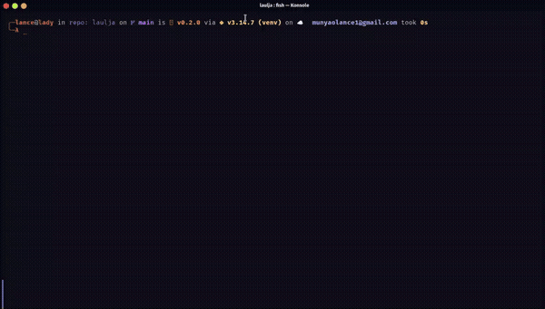

# Laulja

Laulja is a yt-music-tui in Python — a terminal UI for YouTube Music with real playback, a live
FFT bar visualizer, and synced lyrics, all from the terminal.

## Demo



([full-quality video](docs/demo.mp4))

It's built on:

| Concern               | Library/tool                                                           |
|------------------------|-------------------------------------------------------------------------|
| TUI framework          | [Textual](https://textual.textualize.io/)                               |
| YouTube Music API      | [ytmusicapi](https://ytmusicapi.readthedocs.io/)                        |
| Stream URL resolution  | [yt-dlp](https://github.com/yt-dlp/yt-dlp)                              |
| Audio decode/output    | ffmpeg → PortAudio (`sounddevice`), falling back to pw-play/paplay/aplay on Linux |
| Bar visualizer FFT     | numpy                                                                    |
| Cookie decryption      | `cryptography`                                                           |
| Lyrics                 | LRCLIB                                                                   |

## Install

```bash
pipx install laulja   # or: uv tool install laulja
```

`pipx`/`uv tool` give it its own isolated environment — no venv to manage, `pipx upgrade
laulja` to update. Works on Linux, macOS, and Windows.

To hack on it from a checkout instead:

```bash
python3 -m venv .venv
source .venv/bin/activate
pip install -e .
```

**System dependency:** `ffmpeg` for decoding — install it via your OS's package manager
(`apt install ffmpeg`, `brew install ffmpeg`, `scoop install ffmpeg`, …).

Audio output uses [PortAudio](https://www.portaudio.com/) (via the `sounddevice` package,
installed automatically) and works out of the box on all three platforms. On Linux, if
PortAudio's system library (`libportaudio2`) isn't installed, it automatically falls back to
shelling out to `pw-play` (PipeWire), `paplay` (PulseAudio), or `aplay` (ALSA) instead — so at
least one of those four needs to be available.

Automatic browser-cookie detection (see below) only runs on Linux; macOS and Windows fall back
to the manual cookie-paste flow, which works the same everywhere.

## Run

```bash
laulja                       # start the TUI (opens browser login if needed)
laulja --login               # force the browser sign-in flow
laulja --auth-status         # load cookies and validate auth
laulja --import-cookies path # copy a cookies.txt into config and validate
laulja --help
```

On first run (or once cookies expire) it opens `music.youtube.com` in your browser, then tries
to auto-detect the resulting session from your browser's cookie store (Chrome, Chromium, Brave,
Edge, Firefox). If that fails, it falls back to pasting the `Cookie` request header copied from
DevTools.

## Keybindings

```
Tab        cycle focus between Tracks, Queue, and Playlists
←/→        switch panel (single-view mode only)
j/k, ↑/↓   move selection
Enter      play selected track / queue item · open selected playlist · play a track inside it
Space      play/pause
n / p      next / previous track
l          like / unlike the track that's playing
x          remove the selected track from the Queue panel
/          search — Tracks or Playlists, whichever panel is focused (Esc cancels, Enter runs it)
Esc        back to library from search results · back out of an opened playlist
f          cycle fullscreen: normal → cover+bar → lyrics → normal
c          collapse the sidebar
v          toggle single-view sidebar (one panel at a time, default) vs. stacked (all three)
m          toggle minimalism (strip panel borders and the hint bar)
w          wallpaper mode: full-screen ambient visuals, music keeps playing in the background
             ←/→        cycle visual (spectrum / starfield / rain / plasma) while active
o          sign out (clears saved cookies — sign in again next launch)
q          quit
```

**Wallpaper mode** (`w`) swaps the whole screen for a generative, lofi-style visual — audio
keeps playing exactly as before, just without any of the normal panels on screen. Pick from
four visuals with `←`/`→`: `spectrum` (mirrored bars driven by the real audio spectrum),
`starfield`, `rain`, and `plasma` (a chunky, retro color field) — the latter three animate on
their own even while paused. Playback controls (`space`, `n`/`p`, `l`) still work while it's
active; `w` again returns to the normal layout.

Playing an individual track (library or search) starts a YouTube Music radio/mix seeded from
it — a continuous queue of similar-vibe songs — rather than just the track alone. A playlist
works differently: `Enter` on one *opens* it (its tracks replace the playlist list in the same
panel) rather than playing it outright, same as clicking into a playlist's page in YT Music
itself — `Enter` on a track inside it then plays the whole playlist in order, starting there;
`Esc` goes back to the playlist list. **Liked Songs** shows up as the first entry, browsable the
same way. The Queue panel shows what's playing next: `Enter` jumps straight to a track, `x`
removes one (the currently-playing track can't be removed this way — skip to it instead).

**Lyrics** (synced via LRCLIB) show the line being sung as big block letters in a fixed-height
slot, so it doesn't jump around as line lengths change (a line too long to fit falls back to
plain bold text). The lines just before and after it appear above and below, fading toward grey
with distance — a terminal can't scale or blur text, so depth is faked with dimming. Colors
(panel borders, lyrics, progress bar, visualizer) are derived from the current track's cover
art. Pausing takes effect immediately.

The sidebar starts in **single-view** mode: only the focused panel (Tracks, Queue, or
Playlists) is shown, filling the sidebar's full height so long lists don't need scrolling —
`Tab`/`←`/`→` switch between them. Press `v` to switch to the old stacked layout, where all
three show at once in a fixed height split.

## Slow networks

Playback is built to ride out a weak connection:

- **Read-ahead buffer.** Up to ~30s of decoded audio is buffered ahead of what's playing, so a
  short stall is inaudible. A track waits for ~2s of audio before it starts, and if the buffer
  runs dry mid-track it pauses on "buffering…" (shown in the player bar) until ~5s has built
  back up, instead of stuttering.
- **Adaptive quality.** After two buffer stalls in one track, upcoming tracks switch to a
  lower-bitrate stream (≤70kbps where available); after five smooth tracks in a row it switches
  back. Set `YT_MUSIC_LOW_BANDWIDTH=1` to always use the lower tier.
- **Prefetch.** The next queue entry's stream URL is resolved while the current track plays, so
  skipping and auto-advance don't wait on a fresh lookup.

## Config

| Variable                    | Meaning                                             |
|------------------------------|------------------------------------------------------|
| `YT_MUSIC_COOKIES`           | Cookie file path                                     |
| `YT_MUSIC_SESSION`           | Session file path (geo/visitorData/poToken)          |
| `YT_MUSIC_GEO`                | Geographical location code (default `US`)            |
| `YT_MUSIC_SKIP_LOGIN=1`      | Don't open the browser login flow on startup          |
| `YT_MUSIC_SKIP_AUTH_CHECK=1` | Skip the startup library-access check                 |
| `YT_MUSIC_LOW_BANDWIDTH=1`   | Always stream the lower-bitrate audio tier (see *Slow networks*) |
| `YT_MUSIC_HEADERS_AUTH`      | Path to a `headers_auth.json` generated by `ytmusicapi browser` — use this as a fallback if the built-in cookie-based auth ever gets rejected by YouTube. |

Config/cookies/session files live under `$XDG_CONFIG_HOME/laulja` (or
`~/.config/laulja`).

## Design notes

- **No Node.js dependency.** Stream URLs are resolved with `yt-dlp`, which handles YouTube's
  BotGuard/PoToken challenge internally — one less runtime dependency to install.
- **Textual-based.** The whole UI runs on Textual's reactive/async widget model rather than a
  hand-rolled redraw loop.
- **Auth validation** calls `ytmusicapi`'s `get_account_info()` rather than a library listing,
  since an unauthenticated `ytmusicapi` client silently returns an empty library instead of
  raising — `get_account_info()` gives a reliable signed-in/not-signed-in signal instead.

## Project layout

```
laulja/
  cli.py                  CLI entry point
  config.py                env-driven AppConfig
  models.py                Track/Playlist/Lyrics dataclasses
  auth/                    cookie parsing, browser cookie auto-detect, sign-in flow
  services/
    music_service.py       ytmusicapi + yt-dlp wrapper
    lyrics_service.py       LRCLIB client
    cover_art_service.py    thumbnail fetching
    audio/                  ffmpeg pipeline, audio sink, FFT bar visualizer
  ui/
    app.py                  Textual App: layout, keybindings, state sync
    state.py                shared AppState
    widgets.py              header/tracks/playlists/queue/cover/bar/lyrics/wallpaper panels
    listing.py              scrollable list panel base class
    art_theme.py            derives the UI color theme from cover art
```
